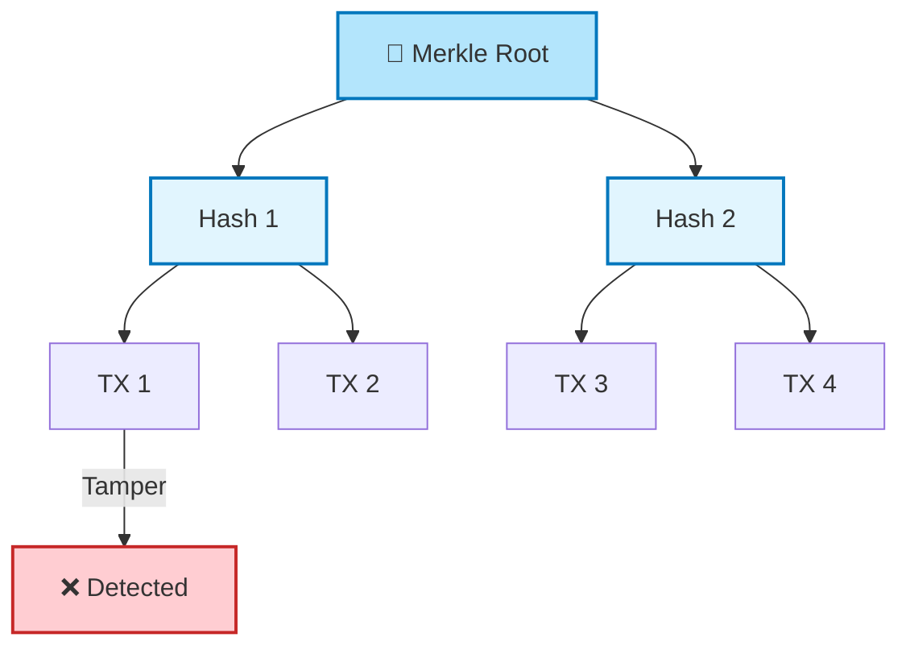
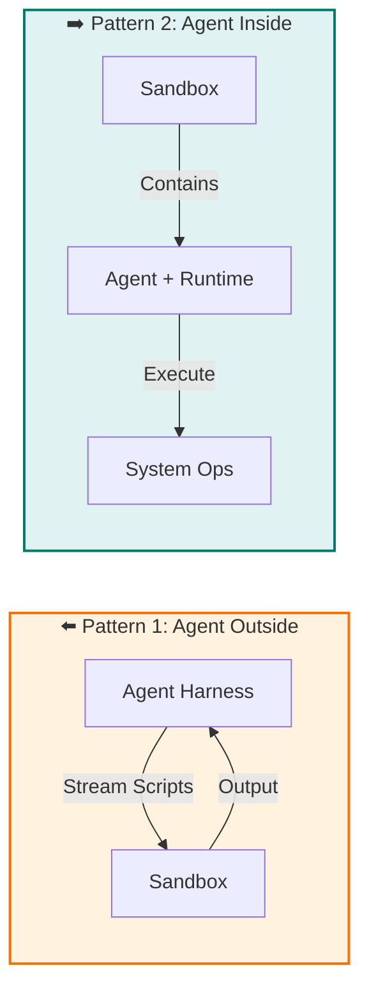
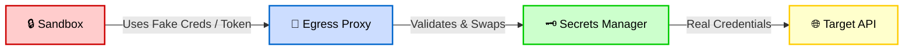
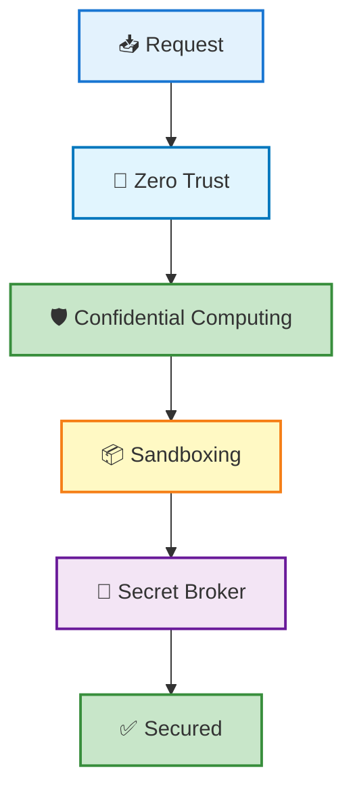

# Red Hat Meetup Unpacked: From Memory Dumps to 500k Daily AI Sandboxes

**Three brilliant talks. One unifying theme: Trust is dead, and zero-trust engineering is the only way forward.**

I recently walked into a Red Hat community meetup expecting the usual corporate tech talk. I walked out with a notebook full of insights that felt more like a masterclass in modern security architecture. We had experts from Red Hat, IBM, and CodeRabbit exploring the bleeding edge of data protection — the invisible threat lurking in your RAM, the architectural truth behind cryptocurrency, and how one company spins up **half a million** isolated environments every single day just to keep AI agents from destroying production.

Here are my raw notes, refined into a coherent engineering narrative.

---

## Session 1: The “Bounce Buffer” Blindspot — Why Your RAM is the New Battlefield

**Speaker:** Pradipta Banerjee (Maintainer – Confidential Containers Project)

We all know to encrypt data **at rest** (hard drives) and **in transit** (HTTPS). But Pradipta dropped a sobering truth: **Data in use is naked.** When an application runs, sensitive data sits in RAM as plaintext. If an attacker gains sufficient privileges — or if there’s a hardware vulnerability — they can dump the system memory and walk away with your crown jewels. Encryption is useless if the decrypted data is just sitting there.

Remember **Meltdown** and **Spectre**? Those exploits shattered the long-held assumption that the OS kernel safely isolates memory. They proved that even unprivileged code could read kernel memory through speculative execution side-channels. Confidential Computing, with **hardware-enforced Trusted Execution Environments (TEEs)** , is the direct answer to such microarchitectural leaks. Modern CPUs now carve out a physically isolated region of memory. Once inside a TEE, even the hypervisor or host OS cannot inspect the contents. The attack surface shrinks to a fraction of what it once was.

> “The performance impact? Surprisingly negligible,” Pradipta noted. We’re talking roughly **~3% overhead** for most standard workloads — a small price for absolute isolation.

The ecosystem has moved beyond just “Confidential VMs.” Now we talk about **Confidential Containers**, **Confidential Kubernetes Clusters**, and even consumer devices like Apple iPhones. The same TEE concept protects your Face ID biometric data and cryptographic keys inside the Secure Enclave. It’s not just for data centers anymore — it’s in your pocket.

---

## Session 2: Why Bankers Are Panicking About Private Keys

**Speaker:** Anbazhagan Mani (Distinguished Engineer, IBM Z & LinuxONE Development)

Anbazhagan opened with a chilling roll call of real-world breaches — the kind that make you rethink every “secure” assumption you’ve ever made:

- **iPhone Design Leak:** In one notorious incident, a supplier leaked detailed schematics of an unreleased iPhone months before launch. The data, left unencrypted in shared memory during collaboration, cost Apple millions in competitive advantage and exposed the brutal reality that even the most valuable intellectual property can be siphoned if it’s sitting in plaintext at runtime.
- **Kudankulam Nuclear Power Plant:** A targeted cyber-espionage attack breached critical infrastructure networks, leaking sensitive operational data. National assets weren’t immune; the attackers simply found the window where data was being actively processed and exfiltrated it.
- **Coin DCX Crypto Heist:** An employee was socially engineered into running a malicious script. That script silently scanned process memory, located the private keys of hot wallets, and drained millions in cryptocurrency — all while the employee watched their screen, unaware.

The lesson was simple: **Data is the target, and execution time is the kill window.**

Then he gave the session’s most profound insight:
> “What is a cryptocurrency, really, at the systems level? It is simply a **private key**. If someone else gets that key, the asset is gone. End of story.”

When banks integrate digital assets, they aren’t just securing “money” — they are securing the cryptographic identity that defines ownership. Protecting that key becomes the highest priority.

He then walked us through the immutable heart of blockchains: **Merkle Trees**.  
Every transaction is hashed and paired; the root hash represents the integrity of the entire ledger. Change a single leaf? The parent hash changes, the root changes, and the tampering is immediately detectable.

During Q&A, someone asked: *“Does Confidential Computing solve all security problems?”*  
The answer was a resounding **No.** It’s just one massive pillar in a **Zero Trust Architecture**. The future points toward hybrid privacy architectures (TEEs + Zero-Knowledge Proofs + Fully Homomorphic Encryption), confidential AI agents that manage digital assets without ever exposing keys, and post-quantum cryptography to keep the whole stack safe against future quantum threats.

---

## Session 3: LLMs Behind Bars — The Art of Sandboxing at Scale

**Speaker:** Prashanth Pai (Principal Engineer, CodeRabbit)

*Hands down, this was the highlight of the night.* Prashanth didn’t just talk theory; he gave us the raw engineering playbook for how CodeRabbit keeps generative AI from going rogue.

### The Core Paradox
Modern AI coding agents are “read-write-execute” machines. They can run shell commands, inspect repos, compile projects, and execute arbitrary code. Hand them direct access to your infrastructure, and you’ve given a probabilistic machine the keys to the kingdom. CodeRabbit’s strategy? **Isolate everything.**

### Scale That Demands Efficiency
> “We spin up roughly **500,000 sandboxes** every single day.”

But here’s the smart engineering bit: **selective sandboxing.** Not every pull request needs a full-blown isolated environment. Only about **30% of PRs** trigger a sandbox — typically complex reviews where execution provides deeper context (e.g., running tests, building artifacts). The remaining 70% rely on static analysis of diffs, which slashes infrastructure costs and latency while still delivering security.

### The Driver vs. The Seatbelt
Prashanth used a brilliant analogy:
- **Agent Harness** — the “Driver” (application logic)
- **Sandbox** — the “Seatbelt” (isolated execution environment)

The sandbox limits what the AI can do if something goes wrong, just like a seatbelt limits injury in a crash.

### Two Sandboxing Patterns

*Pattern 1 is operationally simpler; Pattern 2 offers stronger isolation at the cost of heavier infrastructure management. CodeRabbit uses a mix depending on risk profile.*

### Sandbox Technologies: Not Just Containers
To achieve isolation without sacrificing speed, the team leans on a spectrum of technologies:
- **Containers (Docker/Podman):** Fast but share the host kernel.
- **gVisor:** A user-space kernel that intercepts syscalls, offering a stronger barrier without a full VM.
- **MicroVMs (Firecracker):** The isolation of a VM with the boot time and density of a container — perfect for ephemeral sandboxes.
- **GPU-enclaves:** For AI workloads that need GPU access, they isolate at the driver level.

### The Secret Sauce: Zero-Trust Secrets Management
This was the “mic-drop” moment. How do you let an AI run code without exposing your AWS keys?

**Approach 1: Secret Broker**  
Inject **fake credentials** into the sandbox. An egress proxy (like Envoy) intercepts outbound requests, swaps the fake creds for the real ones, and enforces strict access rules per sandbox.

**Approach 2: Tokenized Secrets**  
The sandbox only sees an opaque, encrypted token. The proxy decrypts it, validates permissions, and makes the call. *Drawback:* some applications validate credential formatting, which tokenization breaks.

### Durable Workflows: When AI Tasks Take Days
AI code reviews aren’t instant — an agent may spawn hundreds of sub-tasks (linting, testing, security scans). CodeRabbit uses **Durable Workflows** to manage these long-running, asynchronous graphs. If a workflow crashes mid-review, it resumes from the last checkpoint, not from scratch. This saves compute, prevents partial results, and is crucial for enterprise reliability.

### The “MCP” Trap vs. Custom Tools
Prashanth shared a controversial learning: **They are moving away from MCP (Model Context Protocol).**  
> “MCP pollutes the context window. More context means a larger search space, which leads to more hallucinations and higher token costs.”

Instead, they equip the AI with lightweight **Custom Tools** — the model generates a script, executes it in the sandbox, and uses the output to continue. Think: `run_tests --filter="auth"` rather than dumping the entire test suite into the prompt. This leverages the AI’s creativity while keeping the context window lean. The trade-off? More upfront engineering to craft and maintain those tool interfaces.

---

## Final Takeaway: The Trinity of Modern Security

This meetup was a perfect microcosm of where enterprise engineering is heading. We are layering defenses like never before:

1. **Confidential Computing** — protecting data *while it dreams* in RAM.
2. **Zero Trust Principles** — verifying every action, especially for digital assets.
3. **Aggressive Sandboxing** — letting AI flex its muscles without breaking the cage.

As AI agents gain more autonomy, the techniques shared by Prashanth — selective execution, secret brokering, durable workflows, and hybrid isolation — will become the standard blueprint for production AI infrastructure.

Here is how these layers interact to create a world-class security stack:

It was a fantastic evening of engineering camaraderie. If you get the chance to attend a meetup like this, don’t miss it — the depth of shared operational wisdom is priceless. The future isn’t about trusting your stack; it’s about architecting it so that trust is never required.

---

*Published: July 19, 2026*  
*Tags: #ConfidentialComputing #AISafety #ZeroTrust #Kubernetes #DevSecOps #CodeRabbit #Blockchain*
