Absolutely. Since you're hosting on a blogging site, **Mermaid diagrams** are much cleaner than ASCII art and render beautifully on GitHub, Docusaurus, MkDocs, Obsidian, etc.

Below are production-quality Mermaid diagrams for your blog.

---

# 1. Confidential Computing (TEE)

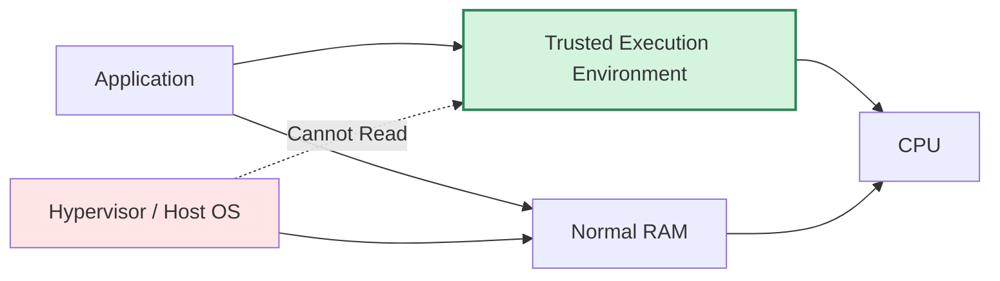
````

---

# 2. Traditional Memory vs Confidential Computing


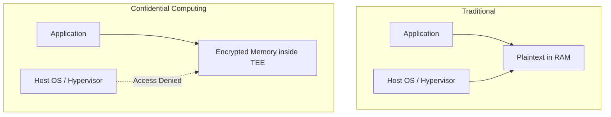
````

---

# 3. Blockchain Merkle Tree

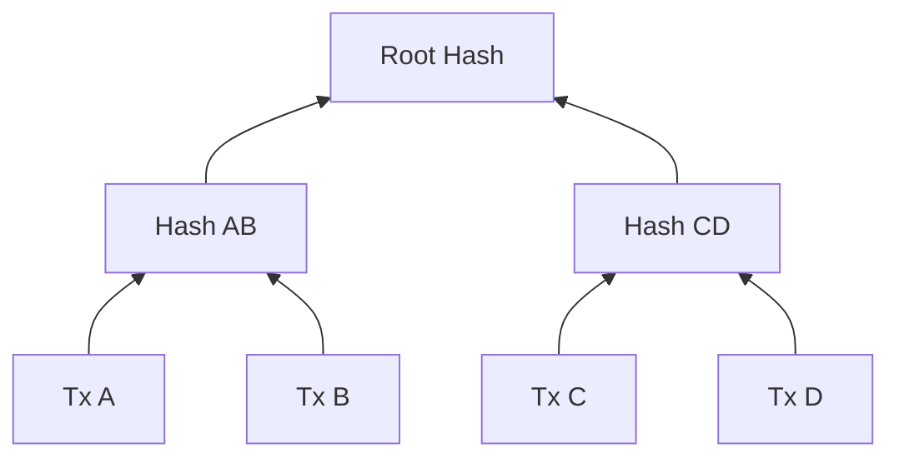
````

---

# 4. Why Merkle Trees are Immutable

````markdown
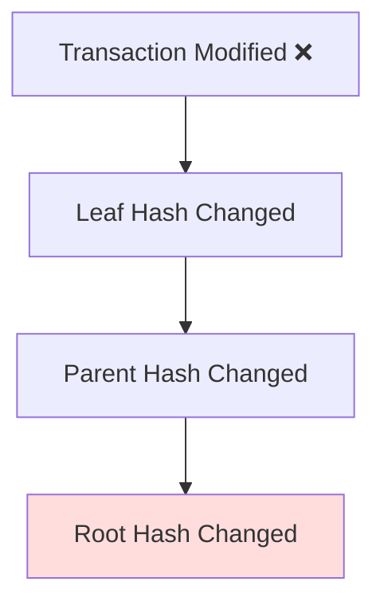
````

---

# 5. Confidential Computing in Banking

````markdown
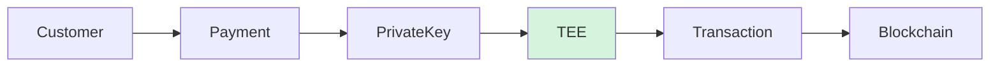
````

---

# 6. Hybrid Privacy Architecture

````markdown
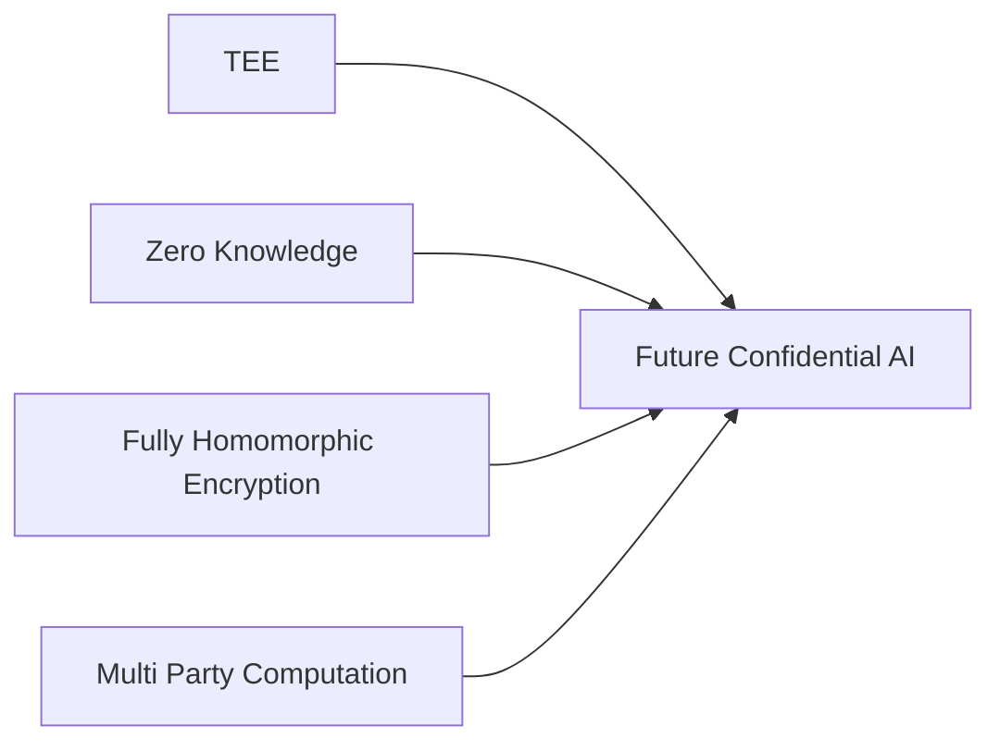
````

---

# 7. CodeRabbit Architecture

````markdown
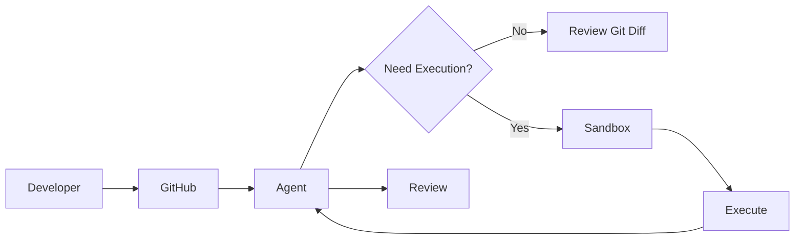
````

---

# 8. Agent Harness vs Sandbox

````markdown
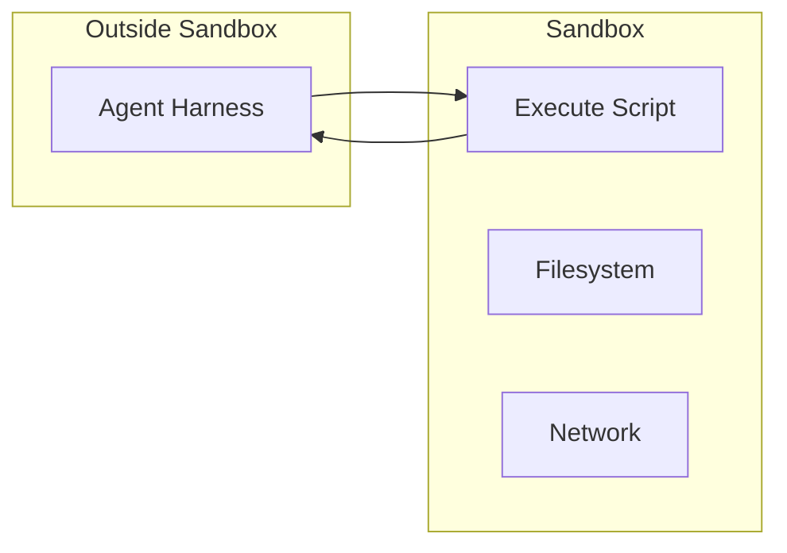
````

---

# 9. Two Sandboxing Patterns

````markdown
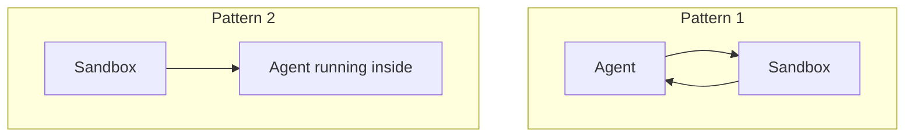
````

---

# 10. Secret Broker Pattern

````markdown
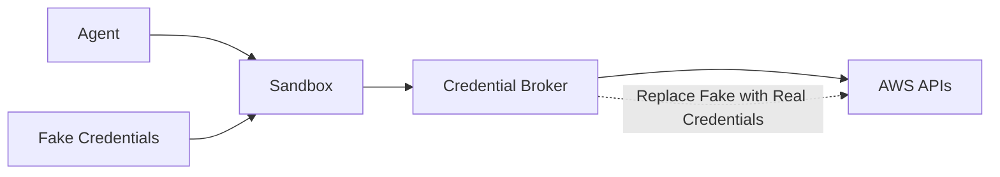
````

---

# 11. Tokenized Secret Pattern

````markdown
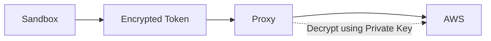
````

---

# 12. Sandbox Technologies

````markdown
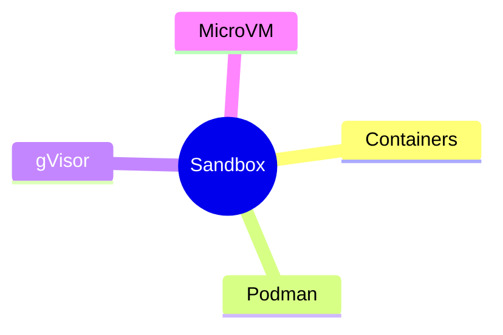
````

---

# 13. CodeRabbit High-Level Request Flow

````markdown
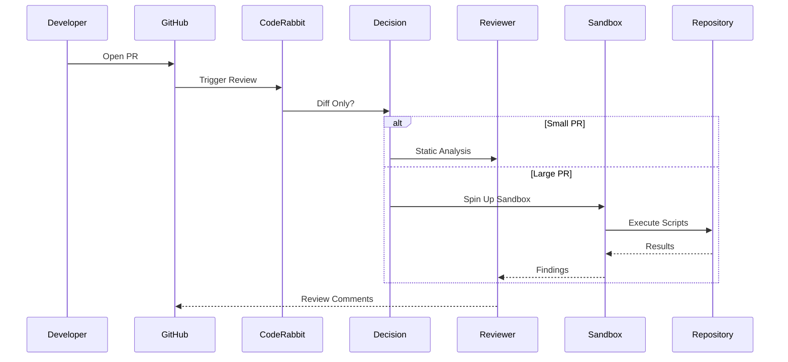
````

---

# 14. MCP vs Custom Tools

````markdown
```mermaid
flowchart LR

subgraph MCP

MCP[MCP Server]

Context[Large Context Window]

end

subgraph Custom Tool

Tool[Custom Tool]

Script[Generated Script]

end

MCP --> Context

Tool --> Script

Script --> SmallerContext[Smaller Search Space]
```
````

---

# 15. Complete Meetup Summary

This would make a great hero diagram near the end of your article.

````markdown
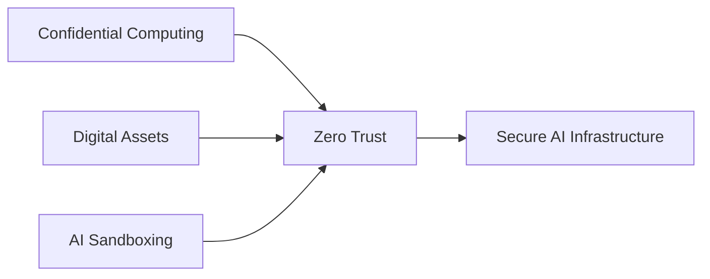
````

## My recommendation

For a polished technical blog, I'd use **only these 6 diagrams**:

1. ✅ Confidential Computing (TEE)
2. ✅ Merkle Tree
3. ✅ CodeRabbit Architecture
4. ✅ Agent Harness vs Sandbox
5. ✅ Secret Broker Pattern
6. ✅ Meetup Summary (the final architecture diagram)

Those six diagrams tell the complete story without overwhelming the reader, and they make the post look like an original engineering article rather than a collection of meetup notes.
