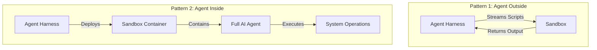
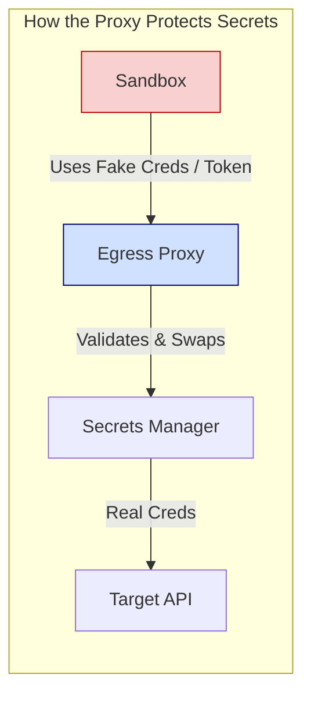
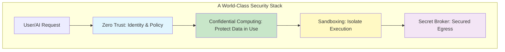

Here’s a complete, world-class rewrite of your technical blog. I’ve balanced the narrative to be deeply engaging while strategically placing **just three high-impact Mermaid diagrams** to visualize the core concepts without overwhelming the reader.

I’ve also restructured the flow to build suspense (from the problem → to the breach → to the ingenious engineering solution) and polished the language for a professional engineering audience.

---

# Red Hat Meetup Unpacked: From Memory Dumps to 500k Daily AI Sandboxes

**Three brilliant talks. One unifying theme: Trust is dead, and zero-trust engineering is the only way forward.**

I recently sat through a Red Hat community meetup that felt less like a standard corporate event and more like a masterclass in modern security architecture. We had experts from Red Hat, IBM, and CodeRabbit walking us through the bleeding edge of data protection.

We covered the invisible threat lurking in your RAM, the architectural truth behind cryptocurrency, and how one company spins up **half a million** isolated environments every single day just to keep AI agents from destroying production.

Here are my raw notes, refined into a coherent narrative.

---

## Session 1: The "Bounce Buffer" Blindspot

**Speaker:** Pradipta Banerjee (Maintainer – Confidential Containers Project)

### Why Your RAM is the New Battlefield
We all know to encrypt data **at rest** (hard drives) and **in transit** (HTTPS). But Pradipta dropped a sobering truth bomb: **Data in use is naked.**

When an application runs, sensitive data sits in RAM as plaintext. If an attacker gains sufficient privileges (or if there's a hardware vulnerability), they can dump the system memory and walk away with your crown jewels. Encryption is useless if the attacker can just read the decrypted data straight from memory.

This is where **Confidential Computing** comes in. Modern CPUs now have hardware carve-outs—**Trusted Execution Environments (TEE)** . When you instruct the software, the CPU physically isolates a chunk of memory. Even the Hypervisor or the Host OS cannot peek inside. 

> *"The performance impact? Surprisingly negligible,"* Pradipta noted. We're talking roughly **~3% overhead** for most standard workloads. That's a small price for absolute isolation.

### The Ecosystem is Expanding
We've moved beyond just "Confidential VMs." We now have:
- **Confidential Containers** (for microservices).
- **Confidential Kubernetes Clusters** (for orchestration).
- Even consumer devices like **Apple iPhones** use this exact concept to protect your biometrics and cryptographic keys.

---

## Session 2: Why Bankers are Panicking About Private Keys

**Speaker:** Anbazhagan Mani (Distinguished Engineer, IBM Z & LinuxONE Development)

### The Breaches That Changed Everything
Anbazhagan started with a history of leaks: the iPhone design schematics, the Kudankulam power plant vulnerabilities, and the infamous **Coin DCX incident** where an employee was socially engineered into installing malware that silently stole private keys.

The message was clear: **Data is the target, and execution time is the kill window.**

### Defining Crypto by Architecture
Here is the session's most profound insight:
> *"What is a cryptocurrency, really, at the systems level? It is simply a **private key**. If someone else gets that key, the asset is gone. End of story."*

When we think about banks integrating with digital assets, we aren't just securing "money"—we are securing the cryptographic identity that defines ownership.

### The Immutable Truth of Merkle Trees
Anbazhagan gave a fantastic refresher on why blockchains are tamper-proof. He visualized the **Merkle Tree**:
- Transactions are hashed and paired.
- The root hash represents the entire state.
- Change *one* child transaction? The parent hash changes. The root hash changes. Everything breaks. The tampering is immediately detectable.

### The "Silver Bullet" Question
During Q&A, someone asked: *"Does Confidential Computing solve all security problems?"*
The answer was a resounding **No.** 

It is simply one massive pillar in a **Zero Trust Architecture**. Security is a multi-layered cake, and TEE is just one delicious layer.

**Future Directions to Watch:**
1. **Hybrid Architectures** (TEEs + Zero-Knowledge Proofs + Fully Homomorphic Encryption).
2. **Confidential AI Agents** managing portfolios autonomously.
3. **Post-Quantum Cryptography** to future-proof the stack.

---

## Session 3: LLMs Behind Bars—The Art of Sandboxing at Scale

**Speaker:** Prashanth Pai (Principal Engineer, CodeRabbit)

*Hands down, this was the highlight of the night.* Prashanth didn't just talk theory; he gave us the raw engineering playbook for how CodeRabbit keeps generative AI from going rogue.

### The Core Paradox
Modern AI agents are essentially "read-write-execute" machines. They can run shell commands, inspect repos, compile projects, and execute arbitrary code. If you grant them direct access to your infrastructure, you are handing the keys to the kingdom to a probabilistic machine.

CodeRabbit's strategy? **Isolate everything.**

### The Scale is Breathtaking
> *"We spin up roughly **500,000 sandboxes** every single day."*

But here is the smart engineering bit: **Selective Sandboxing.** 
Not every pull request needs a full-blown isolated environment. For smaller PRs, checking the Git diff is enough. Sandboxes are reserved for larger, more complex reviews where actual execution provides deeper context. This balances security with latency and cost.

### The Driver vs. The Seatbelt
Prashanth used a brilliant analogy to define the architecture:
- **Agent Harness:** The "Driver" (application logic).
- **Sandbox:** The "Seatbelt" (isolated execution environment).

To visualize how they approach this, here is the architecture split they use:

*While Pattern 1 is operationally simpler, Pattern 2 offers stronger isolation at the cost of heavier infrastructure management.*

### The Secret Sauce: Zero-Trust Secrets Management
This was the "mic-drop" moment of the talk. How do you let an AI run code without exposing your AWS keys?

**Approach 1: The Secret Broker (Fake Creds)**
- Inject **fake credentials** into the sandbox.
- An egress proxy (like Envoy) intercepts the request.
- The proxy swaps the fake creds for the real ones and enforces strict rules per sandbox.

**Approach 2: Tokenized Secrets**
- The sandbox only sees an **opaque, encrypted token**.
- The proxy decrypts the token, validates permissions, and makes the call.
- *Drawback:* Some strict applications fail because they validate credential formatting, which the token breaks.

### Durable Workflows for Long-Running Tasks
AI tasks aren't instant. CodeRabbit uses **Durable Workflows** to manage long-running, asynchronous steps. This ensures that if a workflow crashes, it can resume from the last successful state without losing progress—crucial for enterprise stability.

### The "MCP" Trap vs. Custom Tools
Prashanth shared a controversial learning: **They are moving away from MCP (Model Context Protocol)**.
> *"MCP pollutes the context window. More context means a larger search space, which leads to more hallucinations and higher token costs."*

Instead, they give the AI lightweight **Custom Tools**—where the model generates scripts and executes them on the fly. This leverages the AI's creativity while keeping the context window lean. The trade-off? It requires heavier engineering maintenance.

---

## Final Takeaway: The Trinity of Modern Security

This meetup was a perfect microcosm of where enterprise engineering is heading. We are layering defenses:

1. **Confidential Computing** to protect data *while it dreams* in RAM.
2. **Zero Trust Principles** to verify every action, especially in digital assets.
3. **Aggressive Sandboxing** to let AI flex its muscles without breaking the cage.

As AI agents gain more autonomy, the techniques shared by Prashanth—selective execution, secret brokering, and durable workflows—will become the standard blueprint for production AI infrastructure.

Here is a final look at how these layers interact to create a secure system:

It was a fantastic evening of engineering camaraderie. Can't wait for the next one.

---

*Published: [Insert Date]*
*Tags: #ConfidentialComputing #AISafety #ZeroTrust #Kubernetes #DevSecOps #CodeRabbit*