# Red Hat Meetup: Confidential Computing, Digital Assets & AI Sandboxing

## A Deep Dive into Modern Security Architecture

---

## Table of Contents

- [Introduction](#introduction)
- [Session 1: Confidential Computing Overview](#session-1-confidential-computing-overview)
- [Session 2: Digital Assets Protection](#session-2-why-confidential-computing-matters-to-digital-assets)
- [Session 3: AI Sandboxing at Scale](#session-3-llms-behind-bars-sandboxes-at-scale-for-ai-on-a-short-leash)
- [Key Takeaways](#key-takeaways)
- [Conclusion](#conclusion)

---

## Introduction

I recently had the privilege of attending a Red Hat community meetup featuring distinguished speakers from Red Hat, IBM, and CodeRabbit. The sessions explored three interconnected pillars of modern security architecture:

1. **Confidential Computing** — protecting data during processing
2. **Digital Asset Security** — applying Zero Trust principles to cryptocurrency
3. **AI Sandboxing** — securely executing AI agents at scale

This blog synthesizes my notes, observations, and key learnings from each session.

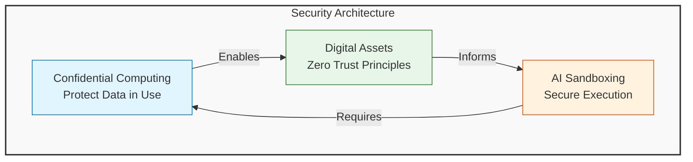

---

## Session 1: Confidential Computing Overview

**Speaker:** Pradipta Banerjee  
*Maintainer – Confidential Containers Project*

### The Problem: Data in the Clear

Traditional security models protect data through encryption:

- **Data at Rest** — encrypted storage
- **Data in Transit** — encrypted communication channels

However, **Data in Use** remains vulnerable. While applications are running, data resides in RAM as plaintext. An attacker with sufficient privileges could:

- Dump application memory
- Extract sensitive information
- Bypass encryption entirely

> "Even with the strongest encryption, your data is exposed during processing. Confidential Computing solves this by protecting data while it's being used."

### Trusted Execution Environments (TEE)

Modern CPUs provide **Trusted Execution Environments (TEE)** . When enabled through software:

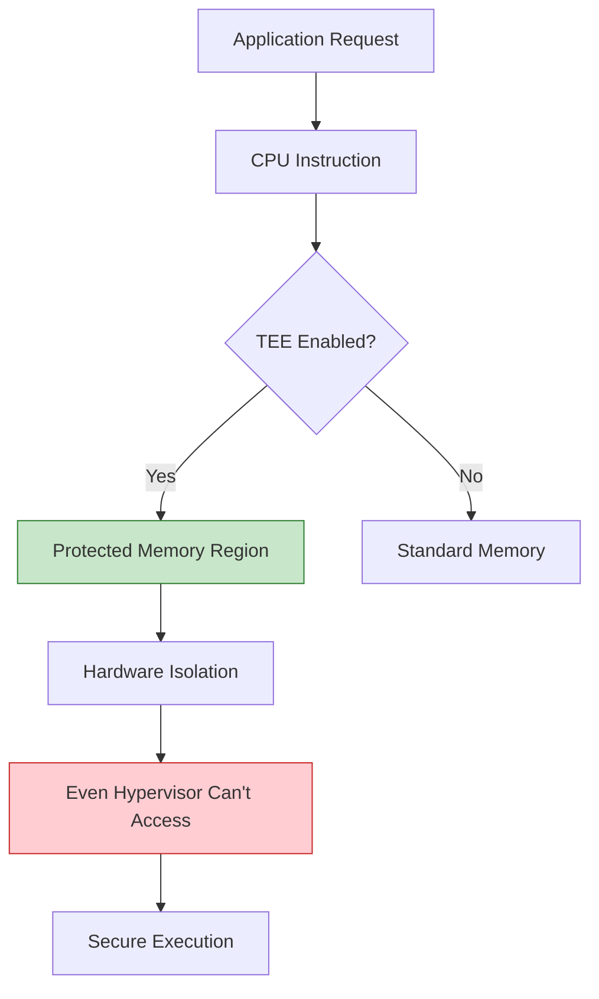

**Key Capabilities:**

- Carves out a protected region of memory
- Only trusted code can access this region
- Even privileged software (hypervisor, host OS) cannot inspect contents
- **Performance overhead: ~3%** — surprisingly minimal for most workloads

### Deployment Models

The ecosystem has evolved significantly:

| Model | Description | Use Case |
|-------|-------------|----------|
| **Confidential VMs** | Traditional VMs with TEE protection | Legacy applications |
| **Confidential Containers** | Containerized workloads with TEE | Cloud-native apps |
| **Confidential Kubernetes** | Orchestrated confidential workloads | Enterprise deployments |
| **Device-Level TEE** | Consumer hardware protection | Mobile devices, IoT |

**Interesting Note:** Apple devices incorporate similar concepts for biometric authentication and cryptographic key storage — making Confidential Computing accessible to billions of consumers.

---

## Session 2: Why Confidential Computing Matters to Digital Assets

**Speaker:** Anbazhagan Mani  
*Distinguished Engineer, IBM Z & LinuxONE Development*

### Real-World Incidents

The session began with sobering examples of security breaches:

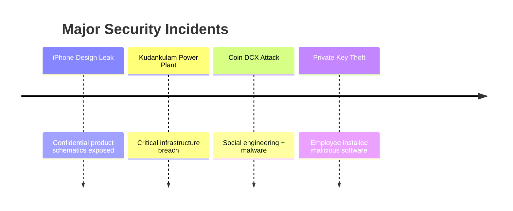

**The core lesson:** Data is valuable, and attackers target wherever sensitive information resides.

### Understanding Cryptocurrency Through Systems Architecture

A fascinating perspective emerged:

> "What exactly is a cryptocurrency at the systems level? Ownership fundamentally comes down to one thing: **the private key.** "

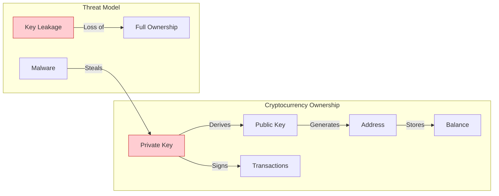

**If someone gains access to your private key, ownership is effectively transferred.** This makes key protection the highest security priority.

### Immutable Data Structures: Merkle Trees

Blockchain systems maintain immutability through Merkle Trees:

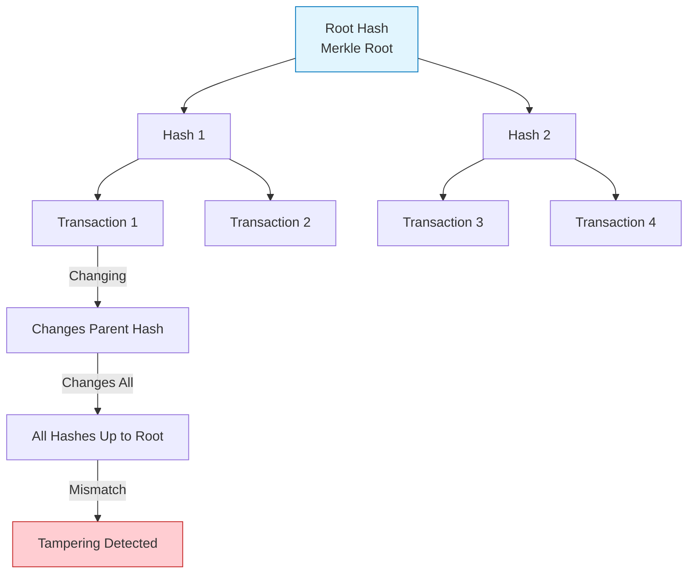

**Why This Matters:**

- Transactions are grouped and hashed recursively
- The root hash represents the integrity of the entire tree
- Changing even a single transaction changes every parent hash
- Tampering becomes immediately detectable

### Banking Industry Implications

As digital assets integrate with financial systems, protecting:

- Payment infrastructure
- Private keys
- Transaction processing

...becomes critical. Confidential Computing adds protection during execution — not just storage or transmission.

### Q&A: Does Confidential Computing Solve Everything?

**Question:** "Does Confidential Computing solve all security problems?"

**Answer:** "No. It's one building block of a Zero Trust Architecture."

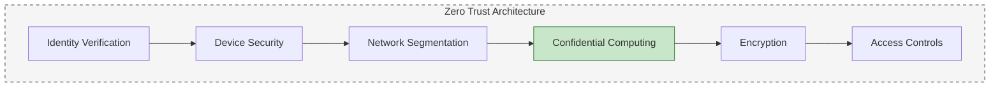

### Future Research Directions

The speaker highlighted emerging areas:

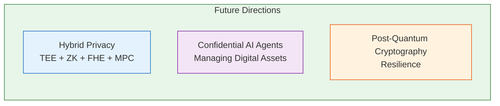

| Technology | Description |
|------------|-------------|
| **Hybrid Privacy Architectures** | Combining TEE + ZK + FHE + MPC |
| **Confidential AI Agents** | AI managing digital assets securely |
| **Post-Quantum Resilience** | Preparing for quantum computing threats |

---

## Session 3: LLMs Behind Bars — Sandboxes at Scale for AI on a Short Leash

**Speaker:** Prashanth Pai  
*Principal Engineer, CodeRabbit*

**My Personal Favorite Session** — this explored practical engineering challenges of securely executing AI agents at massive scale.

### The Core Problem

Modern AI coding agents can:

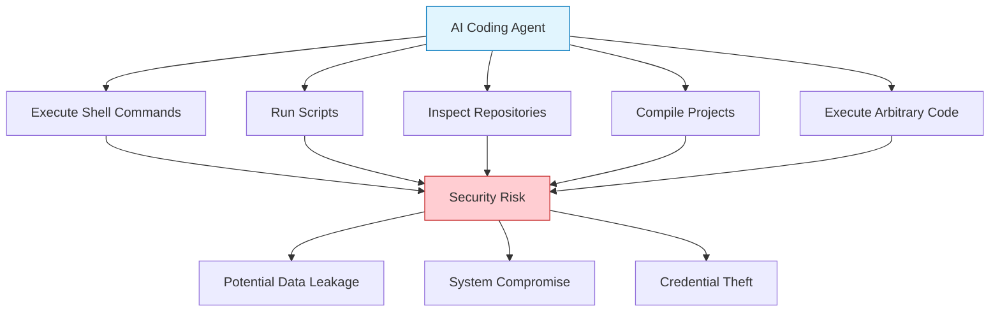

**The Solution:** Isolate execution inside sandboxes rather than trusting generated code.

### Scale: 500,000 Sandboxes Daily

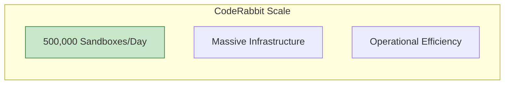

This scale immediately highlights why operational efficiency matters.

### Optimization: Selective Sandboxing

**Not every task requires a sandbox:**

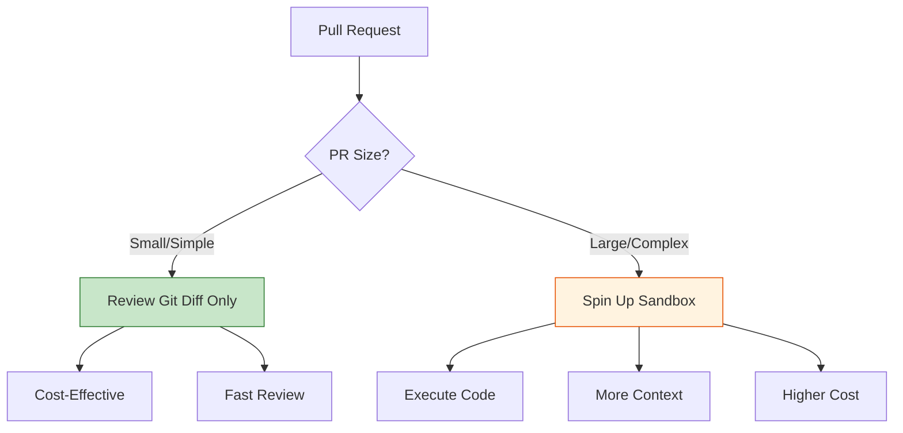

This balance between security and cost is a great engineering optimization.

### Agent vs. Sandbox

The speaker distinguished two concepts:

| Concept | Description | Analogy |
|---------|-------------|---------|
| **Agent Harness** | Application logic coordinating the AI | Driver |
| **Sandbox** | Isolated execution environment | Seatbelt |

> "The sandbox limits what the AI can do if something goes wrong — just like a seatbelt limits injury in a crash."

### Two Sandboxing Patterns

#### Pattern 1: Agent Outside the Sandbox

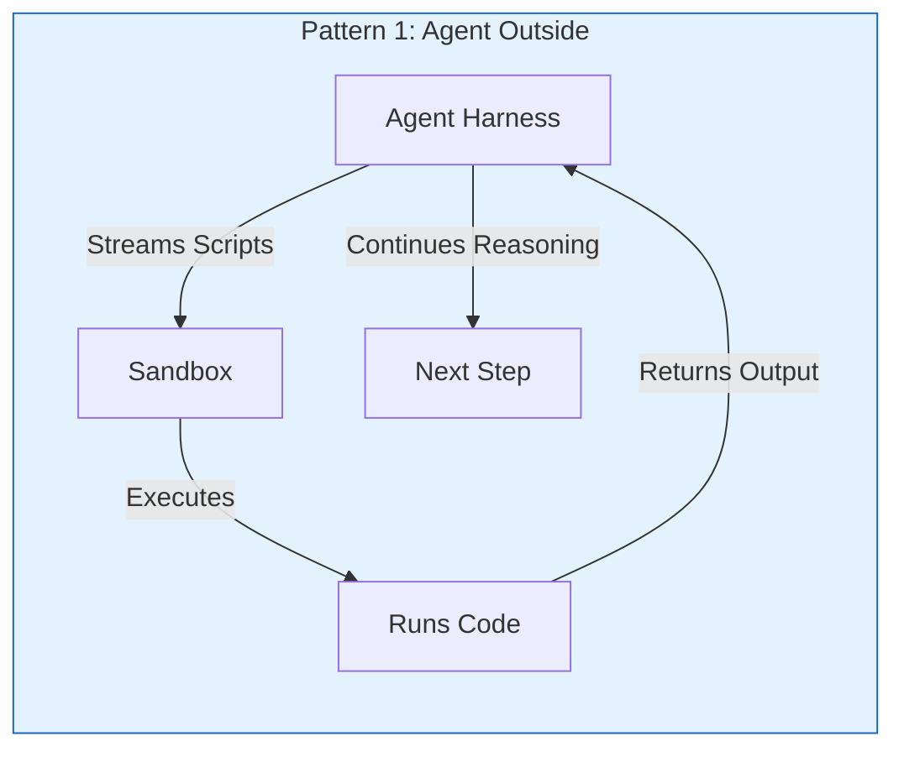

**Advantages:**
- Operationally simpler
- Easier to manage
- Faster to implement

#### Pattern 2: Agent Inside the Sandbox

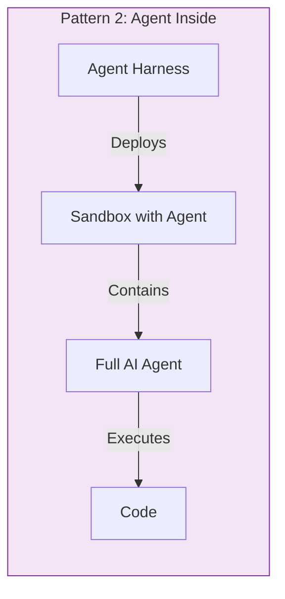

**Advantages:**
- Stronger isolation
- Complete protection

**Trade-offs:**
- Operational complexity
- Lifecycle management
- Infrastructure overhead

### Sandbox Technologies

Containers are only one implementation option:

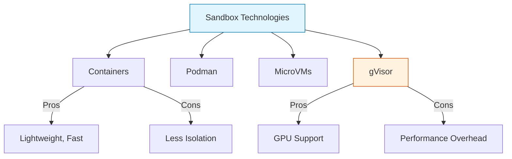

### Secret Management for AI Agents

**The Challenge:** AI agents should never directly access production credentials.

#### Approach 1: Secret Broker

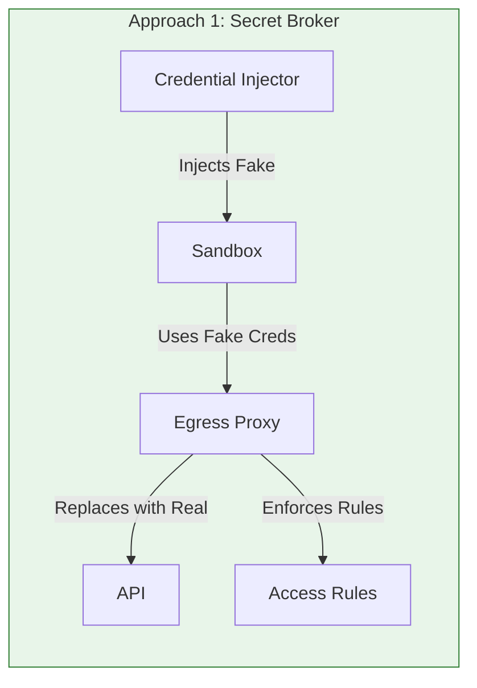

**How It Works:**
1. Fake credentials injected into sandbox
2. Outbound requests pass through proxy
3. Proxy replaces fake with real credentials
4. Access rules enforced per sandbox

**Components:**
- Envoy
- Credential Injectors

#### Approach 2: Tokenized Secrets

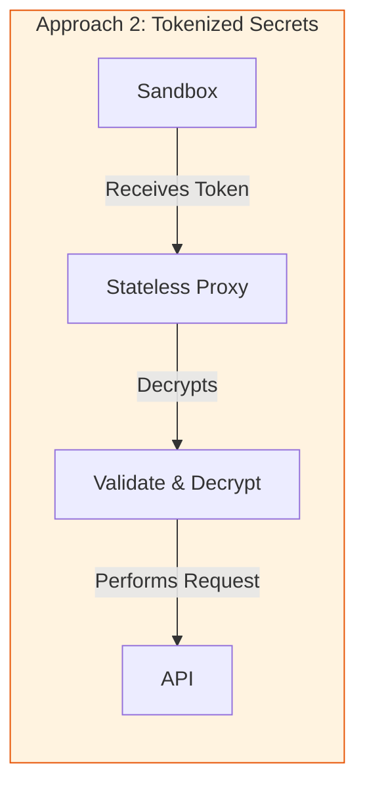

**How It Works:**
1. Sandbox receives opaque encrypted token
2. Proxy decrypts token
3. Validates permissions
4. Performs the request

**Drawback:** Some applications perform credential format validation, complicating tokenization.

### Durable Workflows

Another interesting implementation detail:

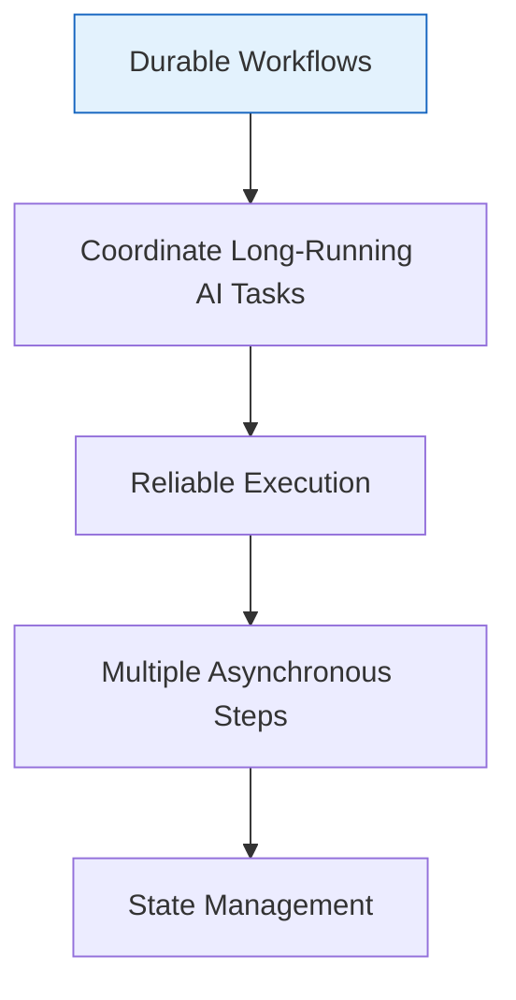

### Learnings About AI Agents

#### The MCP Challenge

> "Model Context Protocol (MCP) often introduces excessive context into the model."

**The Problem:**
- More context = larger search space
- Larger search space = higher token usage
- Higher token usage = increased hallucination risk

**The Alternative:**
Lightweight custom tools where AI generates scripts and executes them as needed.

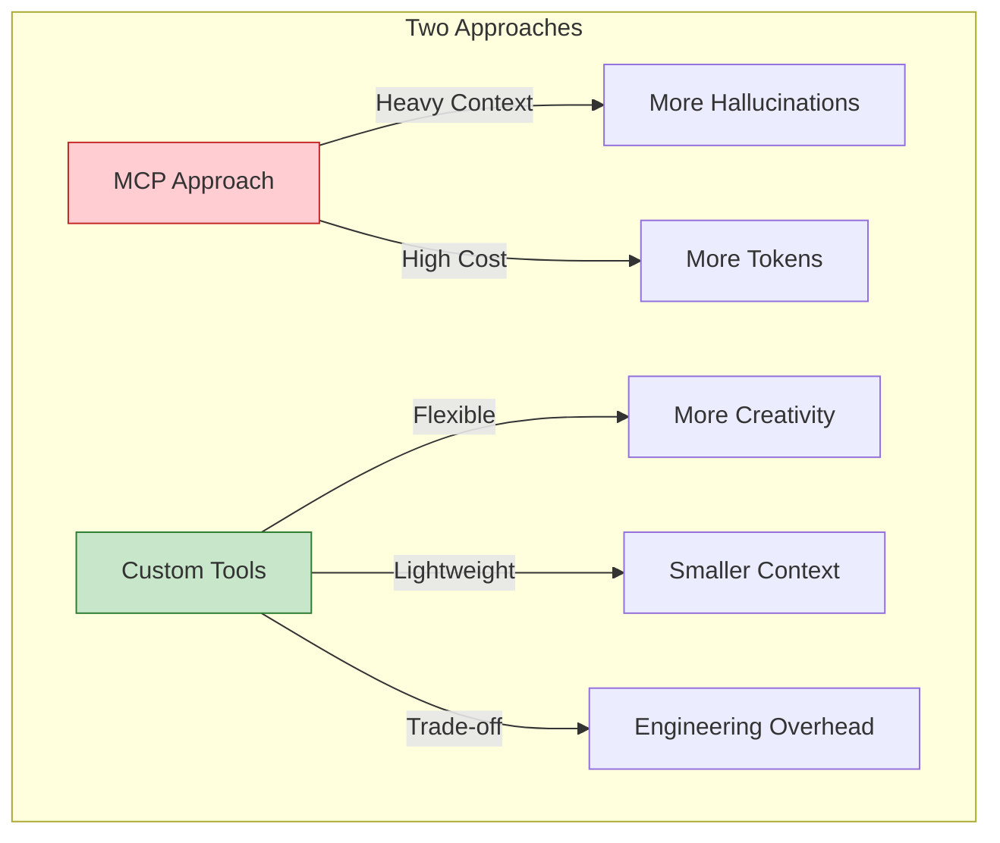

**Trade-off:** Custom tools introduce additional engineering and maintenance overhead.

---

## Key Takeaways

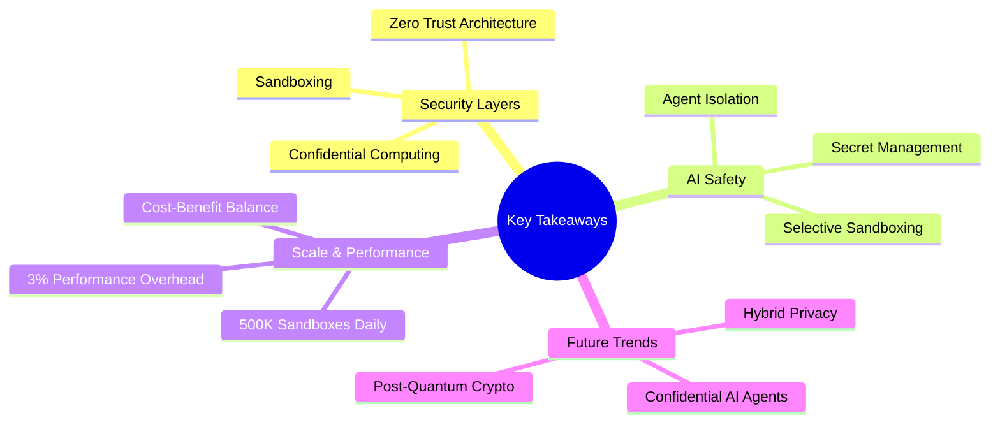

### The Big Picture

1. **Confidential Computing** — Protects data during processing
2. **Digital Assets** — Apply Zero Trust principles
3. **AI Sandboxing** — Secure execution at massive scale

### The Common Thread

My biggest takeaway wasn't any individual technology — it was seeing how modern systems rely on **multiple complementary security layers** rather than a single solution:

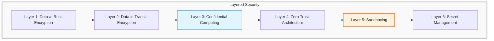

---

## Conclusion

As AI systems gain more autonomy, techniques like:

- **Confidential Computing** — protecting data in use
- **Sandboxing** — isolating AI execution
- **Secure Secret Management** — protecting credentials

...are becoming foundational parts of production AI infrastructure.

The meetup connected three important trends:

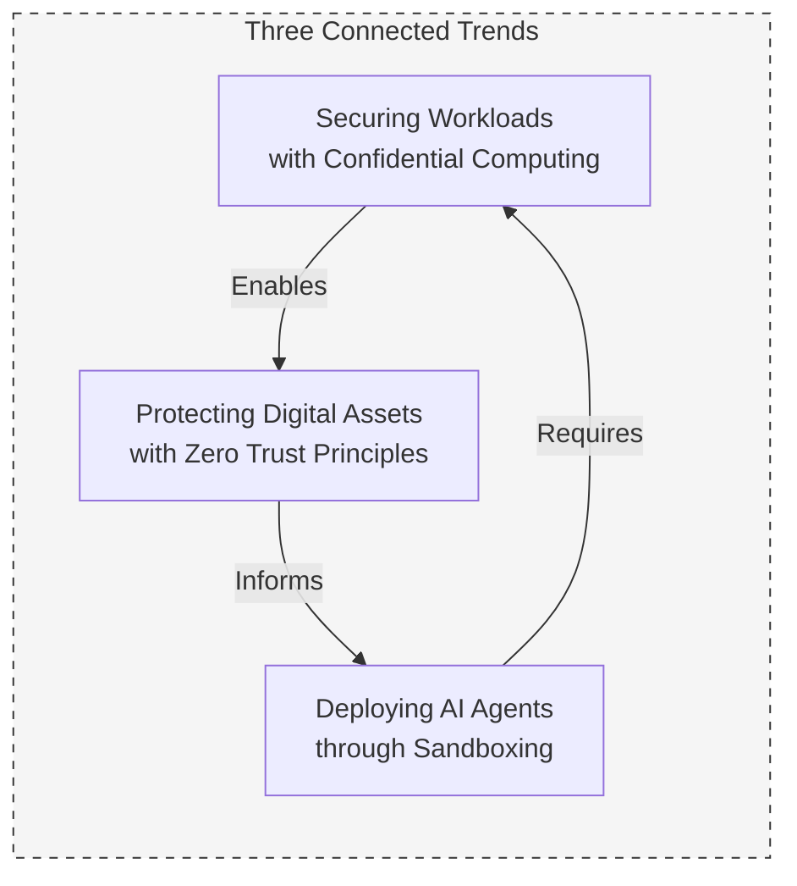

Looking forward to attending more engineering meetups like this and watching these technologies evolve.

---

*Published: [Date of Meetup]*

*Location: Red Hat Community Meetup*

*Tags: #ConfidentialComputing #AISecurity #ZeroTrust #Blockchain #Sandboxing #TechMeetup*