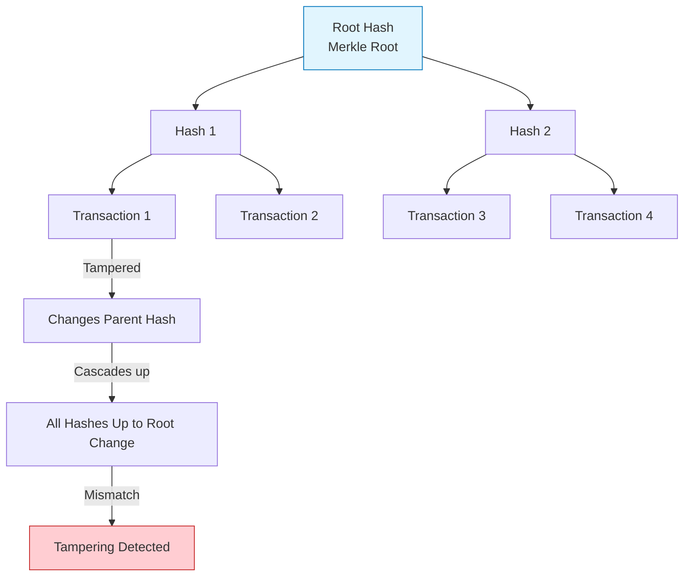
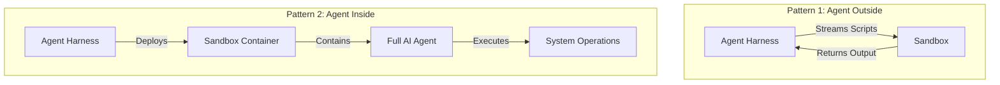
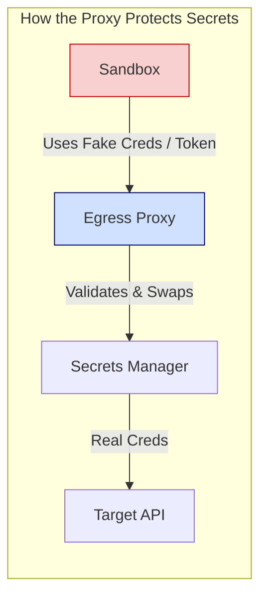
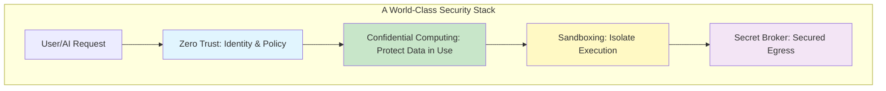

# Red Hat Meetup Unpacked: From Memory Dumps to 500k Daily AI Sandboxes

**Three brilliant talks. One unifying theme: Trust is dead, and zero-trust engineering is the only way forward.**

I recently walked into a Red Hat community meetup expecting the usual corporate tech talk. I walked out with a notebook full of insights that felt more like a masterclass in modern security architecture. We had experts from Red Hat, IBM, and CodeRabbit exploring the bleeding edge of data protection — the invisible threat lurking in your RAM, the architectural truth behind cryptocurrency, and how one company spins up **half a million** isolated environments every single day just to keep AI agents from destroying production.

Here are my raw notes, refined into a coherent engineering narrative.

---

## Session 1: The “Bounce Buffer” Blindspot — Why Your RAM is the New Battlefield

**Speaker:** Pradipta Banerjee (Maintainer – Confidential Containers Project)

We all know to encrypt data **at rest** (hard drives) and **in transit** (HTTPS). But Pradipta dropped a sobering truth: **Data in use is naked.** When an application runs, sensitive data sits in RAM as plaintext. If an attacker gains sufficient privileges — or if there’s a hardware vulnerability — they can dump the system memory and walk away with your crown jewels. Encryption is useless if the decrypted data is just sitting there.

That’s where **Confidential Computing** comes in. Modern CPUs now have hardware carve-outs called **Trusted Execution Environments (TEE)** . When enabled, the CPU physically isolates a chunk of memory. Even the hypervisor or the host OS cannot peek inside. The attack surface shrinks dramatically.

> “The performance impact? Surprisingly negligible,” Pradipta noted. We’re talking roughly **~3% overhead** for most standard workloads — a small price for absolute isolation.

The ecosystem has moved beyond just “Confidential VMs.” Now we talk about **Confidential Containers**, **Confidential Kubernetes Clusters**, and even consumer devices like Apple iPhones that use the same concept to protect biometrics and cryptographic keys.

---

## Session 2: Why Bankers Are Panicking About Private Keys

**Speaker:** Anbazhagan Mani (Distinguished Engineer, IBM Z & LinuxONE Development)

Anbazhagan opened with a chilling roll call of real-world breaches: iPhone design schematics leaked, the Kudankulam power plant vulnerability, and the **Coin DCX incident** where an employee was socially engineered into installing malware that silently stole private keys. The lesson was simple: **Data is the target, and execution time is the kill window.**

Then he gave the session’s most profound insight:
> “What is a cryptocurrency, really, at the systems level? It is simply a **private key**. If someone else gets that key, the asset is gone. End of story.”

When banks integrate digital assets, they aren’t just securing “money” — they are securing the cryptographic identity that defines ownership. Protecting that key becomes the highest priority.

He then walked us through the immutable heart of blockchains: **Merkle Trees**.  
Every transaction is hashed and paired; the root hash represents the integrity of the entire ledger. Change a single leaf? The parent hash changes, the root changes, and the tampering is immediately detectable.



During Q&A, someone asked: *“Does Confidential Computing solve all security problems?”*  
The answer was a resounding **No.** It’s just one massive pillar in a **Zero Trust Architecture**. Future directions point toward hybrid privacy architectures (TEEs + Zero-Knowledge Proofs + Fully Homomorphic Encryption), confidential AI agents, and post-quantum cryptography.

---

## Session 3: LLMs Behind Bars — The Art of Sandboxing at Scale

**Speaker:** Prashanth Pai (Principal Engineer, CodeRabbit)

*Hands down, this was the highlight of the night.* Prashanth didn’t just talk theory; he gave us the raw engineering playbook for how CodeRabbit keeps generative AI from going rogue.

### The Core Paradox
Modern AI coding agents are “read-write-execute” machines. They can run shell commands, inspect repos, compile projects, and execute arbitrary code. Hand them direct access to your infrastructure, and you’ve given a probabilistic machine the keys to the kingdom. CodeRabbit’s strategy? **Isolate everything.**

### Scale That Demands Efficiency
> “We spin up roughly **500,000 sandboxes** every single day.”

But here’s the smart engineering bit: **selective sandboxing.** Not every pull request needs a full-blown isolated environment. For smaller PRs, checking the Git diff is enough. Sandboxes are reserved for larger, more complex reviews where actual execution provides deeper context — a beautiful balance of security, cost, and latency.

### The Driver vs. The Seatbelt
Prashanth used a brilliant analogy:
- **Agent Harness** — the “Driver” (application logic)
- **Sandbox** — the “Seatbelt” (isolated execution environment)

The sandbox limits what the AI can do if something goes wrong, just like a seatbelt limits injury in a crash.

### Two Sandboxing Patterns

*Pattern 1 is operationally simpler; Pattern 2 offers stronger isolation at the cost of heavier infrastructure management.*

### The Secret Sauce: Zero-Trust Secrets Management
This was the “mic-drop” moment. How do you let an AI run code without exposing your AWS keys?

**Approach 1: Secret Broker**  
Inject **fake credentials** into the sandbox. An egress proxy (like Envoy) intercepts outbound requests, swaps the fake creds for the real ones, and enforces strict access rules per sandbox.

**Approach 2: Tokenized Secrets**  
The sandbox only sees an opaque, encrypted token. The proxy decrypts it, validates permissions, and makes the call. *Drawback:* some applications validate credential formatting, which tokenization breaks.



### Durable Workflows for Long-Running Tasks
AI tasks aren’t instant. CodeRabbit uses **Durable Workflows** to manage long-running, asynchronous steps. If a workflow crashes, it resumes from the last successful state — crucial for enterprise stability.

### The “MCP” Trap vs. Custom Tools
Prashanth shared a controversial learning: **They are moving away from MCP (Model Context Protocol)**.  
> “MCP pollutes the context window. More context means a larger search space, which leads to more hallucinations and higher token costs.”

Instead, they give the AI lightweight **Custom Tools** — the model generates scripts and executes them on the fly. This leverages the AI’s creativity while keeping the context window lean. The trade-off? Heavier engineering and maintenance overhead.

---

## Final Takeaway: The Trinity of Modern Security

This meetup was a perfect microcosm of where enterprise engineering is heading. We are layering defenses like never before:

1. **Confidential Computing** — protecting data *while it dreams* in RAM.
2. **Zero Trust Principles** — verifying every action, especially for digital assets.
3. **Aggressive Sandboxing** — letting AI flex its muscles without breaking the cage.

As AI agents gain more autonomy, the techniques shared by Prashanth — selective execution, secret brokering, and durable workflows — will become the standard blueprint for production AI infrastructure.

Here is how these layers interact to create a world-class security stack:



It was a fantastic evening of engineering camaraderie. If you get the chance to attend a meetup like this, don’t miss it — the depth of shared operational wisdom is priceless.

---

*Published: July 19, 2026*  
*Tags: #ConfidentialComputing #AISafety #ZeroTrust #Kubernetes #DevSecOps #CodeRabbit #Blockchain*
```